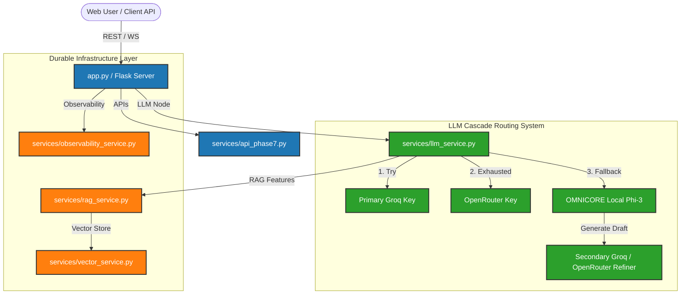

# ForgePrompt Platform Master Guide 🛠️🚀

**ForgePrompt** is a production-grade, enterprise-ready prompt-engineering intelligence engine, autonomous agent orchestrator, and parallel DAG workflow execution platform. Built with a Flask blueprint microservices layer and a MySQL database backend, it features transactional outbox event buses, a 3-tier cascade fallback router, dynamic prompt refinement, distributed tracing, and specialized local GPU resource/VRAM schedulers.

---

## 🗺️ System Architecture

The diagram below illustrates how incoming user requests flow through the API layers, parallel DAG execution engines, LLM cascade routers, and fallback local models:



---

## 📂 Deep Dive: Repository Directory Layout

The codebase is organized into modular layers that separate API routing, business services, agent logic, database structures, and the fine-tuning sandbox:

### 1. Root Directory files
- **`app.py`**: The central application coordinator. It boots the Flask server, registers administrative blueprints, manages CORS policies, and coordinates parallel DAG workflow runs via `WorkflowRunner`.
- **`config.py`**: Global environment variable and configuration loader. Safely exports secrets, database connection URLs, API endpoints, and upload limits to the rest of the application.
- **`models.py` / `models_phase7.py`**: Handles low-level database operations. Features pooled MySQL connection controls, thread-safe cursor operations, and database migration helpers.

---

### 2. The `services/` Directory (Core Microservices Layer)
This directory houses the core business logic, orchestrating AI features, database access, and LLM optimization:

#### LLM Core Routing & Intelligence
- **`llm_service.py`**: The 3-tier LLM cascade router. Intercepts failures, runs local OMNICORE inferences, and executes external critique-refinements.
- **`smart_prompt_classifier.py`**: Classifies prompts into reasoning domains (Math, Logic, Coding, etc.) using embedding models.
- **`model_evaluator.py`**: Evaluates model performance against constraints.

#### Enterprise RAG & Context
- **`rag_service.py`**: Core Retrieval-Augmented Generation execution.
- **`embedding_service.py`**: Computes dense vector embeddings for text chunks.
- **`vector_service.py`**: Manages vector database indexing and retrieval (MySQLVectorStore).
- **`memory_service.py`**: Handles conversational memory windows.

#### Observability & Utilities
- **`observability_service.py`**: Logs application-wide metrics.
- **`event_bus.py`**: Asynchronous internal messaging.
- **`config_service.py`**: Centralized config and feature flag routing.
- **`sandbox_service.py` & `plugin_sdk.py`**: Tools for securely executing extensions.

---

### 3. The `providers/` Directory (API Adapter Wrappers)
Provides uniform wrappers around external LLM APIs and local model loaders:
- **`groq_provider.py`**: Connects to the Groq Cloud endpoint.
- **`openrouter_provider.py`**: Integrates with OpenRouter APIs, handling fallback schemas.
- **`openai_provider.py`**: Communicates with OpenAI models (GPT-4o, GPT-4o-mini).
- **`local_provider.py`**: Directly communicates with local engines.

---

### 4. The `agents/` Directory (Autonomous Agents Layer)
Hosts specialized agent classes, defining their system prompts, toolsets, and reasoning loops:
- **`planner_agent.py`**: Orchestrates tasks, breaks down requirements, and builds task DAGs.
- **`coding_agent.py`**: Resolves code templates, applies modifications, and fixes bugs.
- **`testing_agent.py`**: Writes unittest files and validates outputs.
- **`security_agent.py`**: Evaluates files for prompt injections and vulnerabilities.

---

### 5. The `OMNICORE/` Directory (Fine-Tuning Sandbox)
The dedicated environment for building, training, and testing the custom **OMNICORE** prompt-engineering model:
- **`model_weights/`**: Contains the saved LoRA adapter configurations and PEFT weights.
- **`generate_dataset_openrouter.py`**: Creates training prompts by running self-critique audits using Gemini-2.5-Flash.
- **`train.py`**: Fine-tunes the Phi-3-mini base model. Employs active VRAM garbage collection to prevent Windows memory crashes.
- **`evaluate.py`**: Benchmarks the fine-tuned model using a 6-metric grading rubric.
- **`evaluate_groq.py`**: Runs end-to-end timing tests on local generations and secondary key refinement passes.

---

### 6. The `infrastructure/` Directory
Manages low-level infrastructure connections (e.g., **`kafka_manager.py`** for distributed message queues and topic events processing).

---

## 🖥️ Administrative Web Portal (UI Dashboard)

ForgePrompt includes a fully featured administrative web portal to manage, monitor, and configure the platform. The UI is built using responsive vanilla CSS, dark mode layouts, smooth micro-animations, and glassmorphism styling:

- **`templates/agents.html` (Agent Manager)**:
  Displays active autonomous agents, their current roles, instructions, and preferred models. Allows managers to register new agents and audit version modifications.
- **`templates/workers.html` (Worker Pool & Autoscaler Dashboard)**:
  Monitors thread pools, bulkhead task allocations, dead-letter queues (DLQ), and autoscaler metrics. Displays real-time worker loads and resource throttle statuses.
- **`templates/scheduler.html` (Cron & Durable Timers Panel)**:
  Displays scheduled workflows, active cron jobs, clocks drift telemetry, and distributed leader-election lock statuses.
- **`templates/approvals.html` (Human-in-the-loop Approval Inbox)**:
  Lists pending approval requests. Displays snapshots of states before and after execution, allowing administrators to approve or rollback actions.
- **`templates/deployments.html` (Pipeline Configuration Manager)**:
  Tracks deployment configurations across environments (Staging, Production), showing config diffs and environment snapshots.
- **`templates/security.html` (Governance & Guardrails Dashboard)**:
  Configures prompt injection blocks, PII filters, secret keys rotations, and audit registries.
- **`templates/system_metrics.html` (CQRS Performance Metrics)**:
  Displays dashboards showing CQRS latencies, Saga execution states, API costs, and admission controller statistics.

---

## ⚡ Key High-Availability Configurations

### 1. 3-Tier Cascade Fallback & Critique Refinement
To ensure that prompt generation never fails during api rate limits, `llm_service.py` executes a cascade:
1. **Primary Groq**: Call `Llama-3.3-70b-versatile` (fastest & free).
2. **OpenRouter**: Call cloud fallback models if primary key is exhausted.
3. **Local OMNICORE**: Load and run custom Phi-3 adapter weights locally.
4. **Refiner Pass**: Locally-generated prompts are dynamically audited and expanded using a **Secondary Groq Key** (`GROQ_API_KEY_2` on a separate account) or OpenRouter before displaying.

### 2. Transactional Outbox Pattern
Instead of firing events asynchronously during execution (which can lead to lost messages if the database crashes), the `EventBus` publishes messages directly into the `event_outbox` table as part of the same database transaction. The background workers then poll and process this table, guaranteeing at-least-once delivery.

### 3. GPU VRAM Scheduler
The scheduler keeps track of available laptop VRAM (6GB cap). Before spinning up a local GGUF model in Ollama, it evaluates the required footprint. If VRAM is full, it dynamically swaps out idle models or triggers CPU fallback execution to prevent system out-of-memory errors.

---

## 🚀 Installation & Getting Started

### 1. Prerequisite Systems
Ensure you have the following installed on your system:
- Python 3.10+
- MySQL Server (creating a database named `forge_db`)
- Ollama (for native local C++ generation)

### 2. Setup Virtual Environment
Run these commands in your PowerShell terminal:
```powershell
# Create environment
python -m venv env

# Activate environment
.\env\Scripts\Activate.ps1

# Install required libraries
pip install -r requirements.txt
```

### 3. Configure `.env` File
Create a `.env` file in the project root:
```env
MYSQL_HOST=localhost
MYSQL_USER=root
MYSQL_PASSWORD=your_mysql_password
MYSQL_DATABASE=forge_db

# Primary Groq Key
GROQ_API_KEY=gsk_primary_key_here

# Secondary Groq Key (Separate Account)
GROQ_API_KEY_2=gsk_secondary_key_here

# OpenRouter Key
OPEN_ROUTER_API_KEY=sk-or-v1-key_here

SECRET_KEY=your-secure-flask-key
```

### 4. Run the Web Server
Launch the Flask admin dashboard and API nodes:
```powershell
python app.py
```
Open your browser and navigate to `http://localhost:5000` to access the admin portal.
